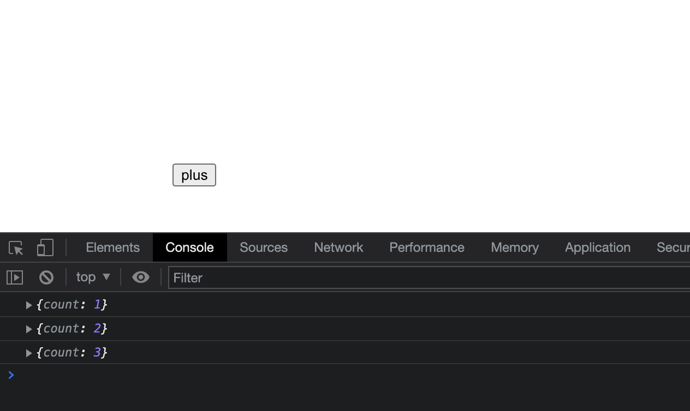

# full-stack-in-js
Web service with JavaScript(React and Express Js) + MySQL

자바스크립트로 프론트와 백엔드를 모두 구축해보며 웹서비스에 대한 전반적인 이해도를 높여보자!

# 개발 환경

아직 번들러를 다룰 줄 모르기에 간단하게 CRA로 웹서버를 구축해보았다. SQL도 할 줄 모르지만, 이 기회에 하면서 배워보도록 하자!

- React.js with Create React App (`CRA`)

  https://create-react-app.dev/ 을 참고한다. 

- Express.js

  Node.js 기반의 웹 서버를 구축할 수 있도록 만들어진 framework로 순수 Node.js로 서버를 구축하는 것보다 훨씬 편한 기능을 제공한다.

- MySQL

  관계형 DBMS로, SQL 쿼리를 통하여 데이터를 가져온다. api를 통하여 웹서버와 연동되어 CRUD를 수행하게 될 것이다.

## 설치 환경

- node js & npm

`node -v`와 `npm -v`로 확인 가능

- MySQL

설치되었다면 `mysql.server start`로 MySQL server 실행 가능, `mysql.server stop`으로 중단 가능하다.

`mysql -u [계정] -p [데이터베이스]`으로 원하는 db에 접속 가능하다.

이후, npm에서 mysql 모듈을 설치하여 express 서버에서 sql문으로 데이터베이스에 접근할 수 있도록 해줘야 한다.

# 두가지 방법이 있습니다.

Express로 웹서버를 먼저 실행하고 그 위에 리액트로 작성된 js파일을 빌드하여 나온 `index.html`을 응답해주는 방법으로 할 수 있다. (이는 실제 배포 환경에서 사용될 것)

혹은, CRA로 개발 서버를 띄우고 Express 서버를 띄워서 접근에 대하여 프록시를 해줘 응답을 하는 방법이 있다. 나는 여기서 **후자의 방법**으로 해주었다. https://create-react-app.dev/docs/proxying-api-requests-in-development/를 따라가면서 해보았다.

## CRA로 리액트 프로젝트 생성

`npx create-react-app full-stack-in-js`로 프로젝트를 생성해준다.

`cd full-stack-in-js`로 접근하여 `npm start`(or yarn start)를 하면 `localhost:3000`에  CRA 초기 페이지가 나오는 것을 확인할 수 있다. 

## Express.js를 이용한 웹 서버 구축

Express 모듈을 설치하고 package.json에 추가해준다. `npm install express --save` 명령어를 통하여 설치부터 package.json까지 한번에 작성할 수 있다. 추가적으로 `nodemon`패키지도 설치해주도록 하자.(노드 파일이 바뀌었을때 새로 서버를 시작하지 않고 바로 적용되도록 함)

그리고 CRA로 만든 리액트 웹서비스와 별개로 js파일을 만들어주었다. 3000번 포트는 CRA서버와 겹치니까 3001번 포트로 웹서버를 구축하였다. 간단하게 Express공식사이트의 예제를 살짝 변형하였다. send 메서드를 통하여 request에 대한 response를 html로 보낼 수 있다.

```js
// full-stack-in-js/server/server.js
const express = require('express');
const app = express();
const PORT = 3001;

app.get('/', (req, res) => {
    res.send(`
    <h1>Hello World!</h1>
    <!--script 안의 콘솔은 브라우저 콘솔창에 찍히게 된다.-->
    <script>console.log('hello world');</script>
    `)
  	//여기서의 콘솔은 서버가 돌아가는 콘솔에 찍히게 된다.
    console.log('request');
});

//서버가 정상 실행되면 아래가 실행될 것이다.
app.listen(PORT, () => {
    console.log(`Example app listening at http://localhost:${PORT}`);
});
```

해당 파일이 있는 디렉토리에서 `npx nodemon server.js`와 같이 실행시켜주면 `localhost:3001`에 서버가 정상적으로 실행되는 것을 확인할 수 있다. 

## Express와 CRA를 연동 (1) proxy setting

react dev server는 3000번 포트에서 실행되고 있고, Express는 3001번 포트에서 실행되고 있다. 여기서 express 서버와 react 개발 서버와 통신하기 위해 index.js를 다음과 같이 바꿔보자. 버튼을 만들어서 3001번 포트에 get방식으로 request를 보내는 것이다. 이러면  `CORS` 에러(한 서버프로그램에서 다른 서버 프로그램으로 데이터가 전송되지 않도록 브라우저 단에서 막는 정책)가 발생하게 된다.

우리가 여기서 해줄 수 있는 방법은 두가지이다.

1. CORS 처리를 해준다.

   express 서버에서 Acess Control Allow Origin설정을 해주어 3000번 포트(리액트 서버)에서 오는 요청을 받도록 header에 설정해주면 된다. 

2. proxy 처리를 해준다.

   `package.json`에서 proxy 속성을 추가하여 리액트 개발서버에서 처리하지 못하는 api 요청에 대하여 3001번 포트의 express 서버로 모두 넘기도록 한다. 예를 들어, `axios.get('/api/get-data')`와 같은 요청에 대하여 react에서 라우팅이 처리되어 있지 않으므로 express서버로 넘겨서 처리하도록 하는 것으로 생각하면 된다.

2번 방식이 더 효율적인데, 이유는 express 서버의 포트가 바뀌는 것에 대하여 URI를 신경쓰지 않아도 되며 이후 쿠키(Cookie)등의 사용에서 권한 처리를 해주지 않아도 된다. 이는 생활코딩님의 [강의](https://www.youtube.com/watch?v=VaAWIAxvj0A)를 참고하였다.

우리는 단지 package.json에 다음을 추가하면 된다.

```json
//in package.json
{
  ...
"proxy": "http://localhost:3001",
  ...
}
```

https://ljh86029926.gitbook.io/coding-apple-react/undefined-1/cra

## Express와 CRA를 연동 (2) coding & test

AJAX 통신 예제를 통하여 실제 데이터를 주고받아보자. App.js에 다음과 같이 작성해주었다. 버튼을 누르면 서버에 저장된 count 변수를 1씩 plus해주도록 하기 위해 다음과 같이 작성하였다.

```react
//App.js
function App() {
  return (
    <div>
      <input type="button" value="plus" onClick={() => {
        fetch('/api/plus').then(res => {
          //서버의 응답을 json형태로 받아 출력
          res.json().then((data) => {
            console.log(data);
          });
        });
      }} style={{ margin: '10rem' }} />
    </div>
  );
}

export default App;

```

`/api/plus` 요청은 react 개발서버에서 처리할 수 없으므로 package.json에 저장된 프록시 주소로 요청이 넘어갈 것이다. 따라서 express 서버에서는 이를 처리해주면 된다. 다음 코드를 추가해주었다.

```js
let count = 0;
//plus버튼을 누르면 count 1씩 더해서 리턴
app.get('/api/plus', (req, res) => {
    count += 1;
    res.send({ count });
});

```

이제 `localhost:3000`에서 브라우저 콘솔창을 열어 작동하는지 확인해보자!



잘 작동한다~! 이제 웹서버와 리액트를 연동시킨 것을 확인하였으니 MySQL을 서버에 연결시켜보자.

## DB 연동


https://codingcoding.tistory.com/449

https://codingapple.com/unit/nodejs-react-integration/

