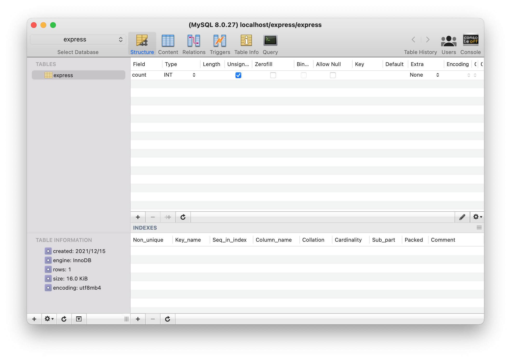
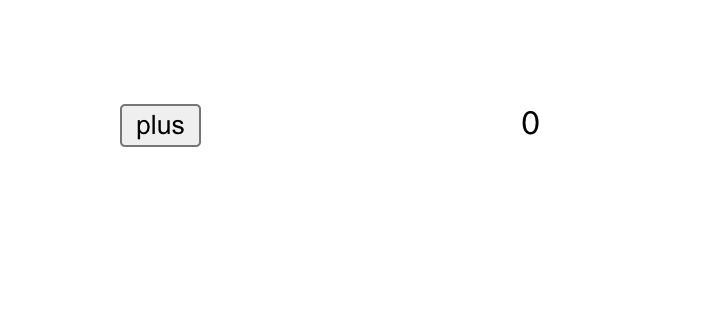
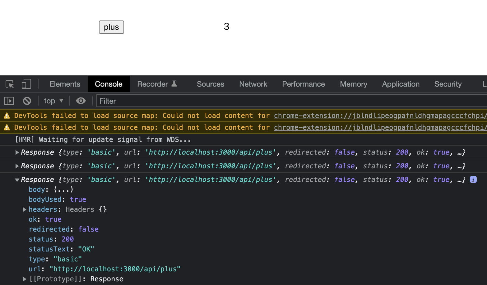

# full-stack-in-js
Web service with JavaScript(React and Express Js) + MySQL

자바스크립트로 프론트와 백엔드를 모두 구축해보며 웹서비스에 대한 전반적인 이해도를 높여보자!

# 개발 환경

아직 번들러를 다룰 줄 모르기에 간단하게 CRA로 웹서버를 구축해보았다. SQL도 할 줄 모르지만, 이 기회에 하면서 배워보도록 하자!

- React.js with Create React App (`CRA`)

  https://create-react-app.dev/ 을 참고한다. 

- Express.js

  Node.js 기반의 웹 서버를 구축할 수 있도록 만들어진 framework로 순수 Node.js로 서버를 구축하는 것보다 훨씬 편한 기능을 제공한다.

- MySQL

  관계형 DBMS로, SQL 쿼리를 통하여 데이터를 가져온다. api를 통하여 웹서버와 연동되어 CRUD를 수행하게 될 것이다.

## 설치 환경

- node js & npm

`node -v`와 `npm -v`로 확인 가능

- MySQL

설치되었다면 `mysql.server start`로 MySQL server 실행 가능, `mysql.server stop`으로 중단 가능하다.

`mysql -u [계정] -p [데이터베이스]`으로 원하는 db에 접속 가능하다.(이후 password 입력)

이후, npm에서 `mysql2` 모듈을 설치하여 express 서버에서 sql문으로 데이터베이스에 접근할 수 있도록 해줘야 한다. 

# 두가지 방법이 있습니다.

Express로 웹서버를 먼저 실행하고 그 위에 리액트로 작성된 js파일을 빌드하여 나온 `index.html`을 응답해주는 방법으로 할 수 있다. (이는 실제 배포 환경에서 사용될 것)

혹은, CRA로 개발 서버를 띄우고 Express 서버를 띄워서 접근에 대하여 프록시를 해줘 응답을 하는 방법이 있다. 나는 여기서 **후자의 방법**으로 해주었다. https://create-react-app.dev/docs/proxying-api-requests-in-development/를 따라가면서 해보았다.

## CRA로 리액트 프로젝트 생성

`npx create-react-app full-stack-in-js`로 프로젝트를 생성해준다.

`cd full-stack-in-js`로 접근하여 `npm start`(or yarn start)를 하면 `localhost:3000`에  CRA 초기 페이지가 나오는 것을 확인할 수 있다. 

## Express.js를 이용한 웹 서버 구축

Express 모듈을 설치하고 package.json에 추가해준다. `npm install express --save` 명령어를 통하여 설치부터 package.json까지 한번에 작성할 수 있다. 추가적으로 `nodemon`패키지도 설치해주도록 하자.(노드 파일이 바뀌었을때 새로 서버를 시작하지 않고 바로 적용되도록 함)

그리고 CRA로 만든 리액트 웹서비스와 별개로 js파일을 만들어주었다. 3000번 포트는 CRA서버와 겹치니까 3001번 포트로 웹서버를 구축하였다. 간단하게 Express공식사이트의 예제를 살짝 변형하였다. send 메서드를 통하여 request에 대한 response를 html로 보낼 수 있다.

```js
// full-stack-in-js/server/server.js
const express = require('express');
const app = express();
const PORT = 3001;

app.get('/', (req, res) => {
    res.send(`
    <h1>Hello World!</h1>
    <!--script 안의 콘솔은 브라우저 콘솔창에 찍히게 된다.-->
    <script>console.log('hello world');</script>
    `)
  	//여기서의 콘솔은 서버가 돌아가는 콘솔에 찍히게 된다.
    console.log('request');
});

//서버가 정상 실행되면 아래가 실행될 것이다.
app.listen(PORT, () => {
    console.log(`Example app listening at http://localhost:${PORT}`);
});
```

해당 파일이 있는 디렉토리에서 `npx nodemon server.js`와 같이 실행시켜주면 `localhost:3001`에 서버가 정상적으로 실행되는 것을 확인할 수 있다. (Example app listening at http://localhost:3001 라고 터미널 콘솔에 나오는 것이 확인되야 함)

## Express와 CRA를 연동 (1) proxy setting

react dev server는 3000번 포트에서 실행되고 있고, Express는 3001번 포트에서 실행되고 있다. 여기서 express 서버와 react 개발 서버와 통신하기 위해 index.js를 다음과 같이 바꿔보자. 버튼을 만들어서 3001번 포트(express 서버)에 get방식으로 request를 보내는 것이다. 이러면 `CORS` 에러(한 서버프로그램에서 다른 서버 프로그램으로 데이터가 전송되지 않도록 브라우저 단에서 막는 정책)가 발생하게 된다.

우리가 여기서 해줄 수 있는 방법은 두가지이다.

1. CORS 처리를 해준다.

   express 서버에서 Acess Control Allow Origin설정을 해주어 3000번 포트(리액트 서버)에서 오는 요청을 받도록 header에 설정해주면 된다. 

2. proxy 처리를 해준다.

   `package.json`에서 proxy 속성을 추가하여 리액트 개발서버에서 처리하지 못하는 api 요청에 대하여 3001번 포트의 express 서버로 모두 넘기도록 한다. 예를 들어, `axios.get('/api/get-data')`와 같은 요청에 대하여 react에서 라우팅이 처리되어 있지 않으므로 express서버로 넘겨서 처리하도록 하는 것으로 생각하면 된다.

2번 방식이 더 효율적인데, 이유는 express 서버의 포트가 바뀌는 것에 대하여 URI를 신경쓰지 않아도 되며 이후 쿠키(Cookie)등의 사용에서 권한 처리를 해주지 않아도 된다. 이는 생활코딩님의 [강의](https://www.youtube.com/watch?v=VaAWIAxvj0A)를 참고하였다.

우리는 **단지 package.json에 다음을 추가하면 된다.**

```json
//in package.json
{
  ,,,
"proxy": "http://localhost:3001",
  ,,,
}
```

참고 링크: [상황에 따라 여러 서버를 이용해야 한다면?](https://ljh86029926.gitbook.io/coding-apple-react/undefined-1/cra)

## Express와 CRA를 연동 (2) coding & test

AJAX 통신 예제를 통하여 실제 데이터를 주고받아보자. App.js에 다음과 같이 작성해주었다. 버튼을 누르면 서버에 저장된 count 변수를 1씩 plus해주도록 하기 위해 다음과 같이 작성하였다.

```js
//App.js
function App() {
  return (
    <div>
      <input type="button" value="plus" onClick={() => {
        fetch('/api/plus').then(res => {
          //서버의 응답을 json형태로 받아 출력
          res.json().then((data) => {
            console.log(data);
          });
        });
      }} style={{ margin: '10rem' }} />
    </div>
  );
}

export default App;

```

`/api/plus` 요청은 react 개발서버에서 처리할 수 없으므로 package.json에 저장된 프록시 주소로 요청이 넘어갈 것이다. 따라서 express 서버에서는 이를 처리해주면 된다. 다음 코드를 추가해주었다. 

```js
let count = 0;
//plus버튼을 누르면 count 1씩 더해서 리턴
app.get('/api/plus', (req, res) => {
    count += 1;
    res.send({ count });
});

```

이제 react와 express 서버 모두 실행시킨 상태에서 `localhost:3000`로 브라우저 콘솔창을 열어 작동하는지 확인해보자!


잘 작동한다~! 이제 웹서버와 리액트를 연동시킨 것을 확인하였으니 MySQL을 서버에 연결시켜보자.

## DB 연동

우선, mysql 서버가 실행되고 있어야한다. `mysql.server start`로 실행한 후 새로운 테이블을 만들어주었다. 나는 아직 SQL이 익숙하지 않아 GUI 기반의 `Sequel Pro` 프로그램을 이용하여 테이블을 만들어주었다. (이 과정에서 접속 오류가 있었는데 [이 글을 보고](https://velog.io/@deannn/macOS-Sequel-Pro-%EC%84%A4%EC%B9%98-%EB%B0%8F-%EC%82%AC%EC%9A%A9-%EB%B0%A9%EB%B2%95) 해결하였다)

MySQL이 로컬 컴퓨터에 설치 및 실행된 상태에서, npm을 통해 mysql 드라이버를 설치하여 DB와 js파일을 연동시켜주도록 하자. `mysql2`패키지는 데이터베이스와 자바스크립트가 연결되도록 api를 제공해준다. 비슷한 `mysql`패키지도 있지만, 이는 비동기적으로만 실행되므로 헷갈리므로 동기적 실행을 가능하게 하는 mysql2를 사용하였다. `npm install mysql2 --save`를 통해 설치하였다. 

위의 예시에서는 서버 파일이 실행될때 count가 0으로 초기화되었지만, count값을 db에서 가져오는 것으로 확장해보려고 한다.

### DB 연결 확인

table명은 express이며, 정수형 field인 count를 만들어주고, 한 row만 만들어 해당 줄의 count를 0으로 초기화한 상태이다.

`server.js`에 다음을 추가해주었다. 우선 같은 파일 디렉토리에 비밀번호를 포함한 기본 정보를 담은 json파일을 분리해주었다(`.gitignore`에도 추가하여 비밀번호 깃허브 공유를 방지)

```json
//db-config.json
{
  "host": "localhost",
  "user": "root",
  "password": "yourpassword",
  "database": "express"
}
```

그리고 require문으로 접속 정보를 불러와 `connectPool()`로 연결해주었다. 여기서 createConnection과 createPool의 차이는 [여기에](https://velog.io/@leitmotif/createConnection-vs-createPool) 잘 정리되어 있다.

```javascript
const mysql = require('mysql');
const db_config = require('./db-config.json');
const connection = mysql.createConnection({
    host: db_config.host,
    user: db_config.user,
    password: db_config.password,
    database: db_config.database
});

connection.connect();

connection.query('SELECT count from express', (error, rows) => {
    if (error) throw error;
    console.log(rows);	//[ RowDataPacket { count: 0 } ]
    console.log(rows[0].count);	//0
});
```

성공적으로 연결되었다면 콘솔에 주석과 같이 찍히게 된다. 이것으로 react 개발 서버, express 서버, sql 서버가 모두 연결이 된 것을 확인할 수 있다.


### plus API 수정

위에서 버튼을 누르면 서버에 저장된 count 변수를 +1해주는 api를 작성했었다. 이를 DB의 count를 가져와 더해주는 것으로 간단하게 수정해보자!

우선 DB에서 count 값을 가져와서 보여주려고 한다. react의 `useEffect` hook을 사용하여 렌더링될 때, DB에서 data값을 가져오도록 하였다. 

```react
//App.js
const [count, setCount] = useState(null);
useEffect(() => {
  fetch("/api/get").then((res) => {
    res.json().then((data) => {
      const { count } = data;
      setCount(count);
    });
  });
}, []);
```

AJAX로 get해주고 이에 대한 get api를 아래의 `server.js`에서 처리해주도록 하였다. DB의 express 테이블에서 count를 가져와서 리턴해주는 것이다.

```javascript
//in server.js
app.get("/api/get", async (req, res) => {
  try {
    const [row] = await pool.query("SELECT count from express");
    const { count } = row[0];
    res.send({ count });
  } catch (e) {
    console.log(e);
  }
});
```

그러고 count를 버튼 옆에다가 보여주도록 하면 아래와 같이 DB table에서 count를 가져와서 보여주는 것을 확인할 수 있다.



이제, 더해주는 것을 반영해주기만 하면 된다.`server.js`에서 plus를 눌렀을 때 DB 값을 처리해주자.

우선 브라우저에서 plus 버튼이 눌리면 server에 함수를 호출하여 수정된 count값을 받아온다고 해준다.

```react
//App.js	
<input
        type="button"
        value="plus"
        onClick={() => {
          fetch("/api/plus").then((res) => {
            //서버의 응답을 json형태로 받아 출력
            console.log(res);
            res.json().then((data) => {
              const { count } = data;
              setCount(count);
            });
          });
        }}
        style={{ margin: "10rem" }}
      />
```

이제 api/plus를 server.js에서 처리해준다.

```javascript
app.get("/api/plus", async (req, res) => {
  try {
    const [row] = await pool.query("SELECT count from express");
    let { count } = row[0];
    console.log("current count : " + count);
    count += 1;
    console.log("modified count : " + count);
    await pool.query(`UPDATE express SET count=${count}`);
    res.send({ count });
  } catch (e) {
    console.log(e);
  }
});

```

express 테이블에서 값을 가져와서 count를 1 더해주고, UPDATE해주었다. 그러고 이를 브라우저에서도 보여줘야 하므로 count를  `response`해주면 된다. 여기서 async~await를 사용한 이유는 mysql 패키지에서 query문을 비동기적으로 실행하는데, 우리는 값을 가져와서→count 값을 1 더해주고 →테이블에 update 해주는 과정이 **동기적으로 일어나야 하기 때문이다**.

count는 리액트에서 state로 관리해주기 때문에 서버에서 응답이 오면 바로 count도 바뀌는 것을 확인할 수 있다.



plus 버튼을 누르면 DB의 count가 update되는 것을 확인할 수 있다. 전체 코드는 [깃허브](https://github.com/choieastsea/full-stack-in-js)에 올려놓았다.

이제서야 혼자 웹 서비스를 간단하게 한 사이클 만들어보았다!

참고) [생활코딩](https://www.youtube.com/watch?v=VaAWIAxvj0A), [코딩애플](https://codingapple.com/unit/nodejs-react-integration/)


